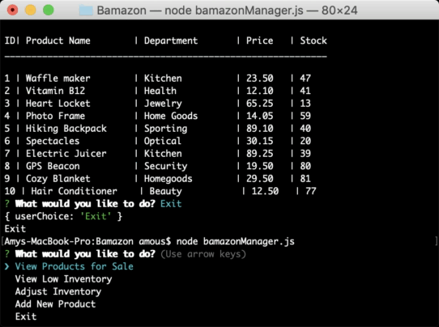

# Bamazon Node & MySQL Application

Bamazon is an Amazon-like storefront built using Node and MySQL. You can interact with MySQL from node to check inventory and order items in the bamazonCustomer application; and adjust inventory in the bamazonManager application.

## Technologies

Technologies used to create app:

1. Javascript
2. MySQL
3. Node
    * NPM Packages
        * Inquirer
        * MySQL
4. Git

## Getting Started

### Test Bamazon on your own machine

Technologies needed to run app:

1. Node.js
2. MySQL Server and Workbench

### Using Bamazon

To use Bamazon, navigate to the folder in terminal where repo is cloned.

### bamazonCustomer.js

Enter 'Node bamazonCustomer.js' into the terminal, and the user will be presented with a list of products they can order.

To purchase products, the user inputs the item number into the terminal. The user is then prompted for the number of units they'd like to order. If enough of the item in inventory to fulfill the order, the order is processed displaying final cost.

If there is an insufficient inventory amount, the user will be notified.

### bamazonManager.js

The bamazonManager.js file promts the user with five choices.

1. View Products for Sale
2. View Low Inventory
3. Add to Inventory
4. Add New Product
5. Exit

#### View Products for Sale

The View Products for Sale option displays the product names, prices, and quantity of each in the inventory.

#### View Low Inventory

The View Low inventory option displays all items with 5 or less of that item in inventory.

#### Adjust Inventory

Adjust Inventory option allows a user to add or delete the quantity of any item to its existing inventory. The app then displays all items with their updated quantities.

#### Add New Product

Add New Product option allows the user to add a new product to the database. The user is prompted to set the product name, department, price, and quantity.  

## More Info

The **github** for this project can be found here: [Github](https://github.com/Amous10/bamazon)

This project was created and is maintained by **Amy Merrill**

Contact me at <amous.fullstack@gmail.com>